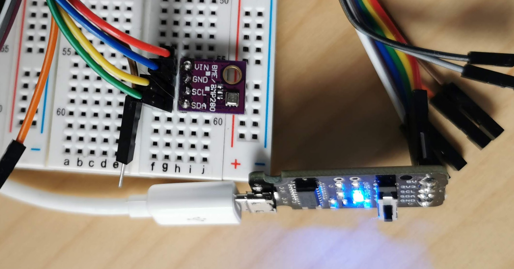

A BME280 Library for cPython and MircoPython
=============================================

This project contains a library to access the BME280 sensor from MicroPython
and cPython. It features a synchronous and in particular *asynchronous* access.

The bme280 driver in this repository is an adaption from
https://github.com/rm-hull/bme280. The repository contains a lot of further
information and documentation.

The common i2c bus interface for Micro- cPython is based on
https://github.com/gkluoe/micropython-smbus.

Usage
-----

### Synchronous from cPython:

~~~python
### i2c #######################################################################
### this uses a usb->i2c hardare interface
### see https://www.fischl.de/i2c-mp-usb/

from i2c_mp_usb import I2C_MP_USB as SMBus
bus = SMBus()

### logging ###################################################################
# not required but useful
import logging
logging.getLogger('').addHandler(logging.StreamHandler())
logging.getLogger('').setLevel(logging.DEBUG)

### main ######################################################################
from bme280.BME280 import BME280
bme280s = BME280(bus)
bme280s.sample()
print(bme280s)
~~~

~~~bash
PYTHONPATH=$(pwd) python examples/cPython-synchronous.py
BME280 base initialized
BME280 last sample: {'timestamp': 1575710195, 'temperature': 22.3, 'humidity': 32, 'pressure': 939.9}
~~~

The BME280 connected via an i2c hardware interface
https://www.fischl.de/i2c-mp-usb/ to a MacBook running cPython:

### Asynchronous from MicroPython

~~~python
# …

import bme280.BME280as
bme280as = bme280.BME280as.BME280as(i2c, intervall_secs=15)
# bme280.BME280as.logger.setLevel(logging.DEBUG)

def bme280as_update_listener(sample):
    for k, v in sample.items():
        if k != "timestamp":
            state[k] = v
    update_display()

bme280as.add_update_listener("main_listener", bme280as_update_listener)

# …
~~~

A BME280 (bottom left) connected to a ESP32 WROVER running MicroPython:

